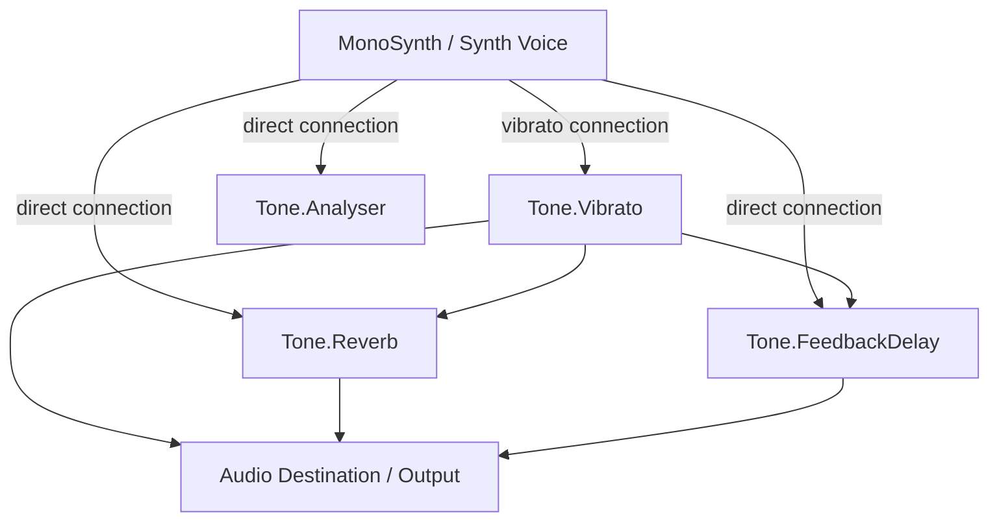

# MIDI & MusicXML Multi-Notation Transposer Studio

This document contains a comprehensive technical summary and system architecture design of the **MIDI to Multi-Notation Letter Notes Web App**, a modern, serverless, client-side React and Tone.js application.

---

## 1. Application Overview
The app allows users to upload standard musical score files (`.mid` or `.musicxml`/`.xml`), process them to isolate the main melody, and transpose the output into readable notation formats.
*   **Scientific Pitch Notation (SPN)**: Western notes with sharps (e.g. `C4`, `D#5`, `F5`).
*   **Indian Classical Sargam**: Pitch notation aligned relative to a base "Sa" pitch class (`S`, `r`, `R`, `g`, `G`, `m`, `M`, `P`, `d`, `D`, `n`, `N`), featuring lower octave indicators (lowercase letters), higher octave indicators (quote suffixes like `S'`), and Komal flat qualifiers (`(k)` suffix).
*   **Visual MIDI Analyzer**: Displays an SVG visualizer mapping notes chronologically with interactive seek support.

---

## 2. Architecture & File Structure

```
src/
├── main.jsx                 # Application entry point
├── App.jsx                  # Core app layout, audio loops & state
├── App.css                  # Core component styles and themes
├── index.css                # Base Tailwind CSS styles and custom UI tokens
├── components/
│   ├── ViolinHero.jsx       # Landing page with particle canvas and hover-plucked SVG violin
│   ├── FileUpload.jsx       # Drag-and-drop MIDI/MusicXML dropzone
│   ├── ControlPanel.jsx     # Track, scale, and octave selectors
│   ├── NotationDisplay.jsx  # Sheet visualization, audio waveform canvas, and print options
│   ├── VisualPianoRoll.jsx  # Interactive SVG piano roll layout with seek support
│   └── ErrorBoundary.jsx    # Catches React render errors
└── utils/
    ├── musicXmlParser.js    # Parses DOM-structured XML music notes
    ├── skylineFilter.js     # Skyline melody isolation algorithm
    ├── keyDetector.js       # Krumhansl-Schmuckler Key Signature detector
    └── notationEngines.js   # Sargam/Western conversions and phrasing
```

---

## 3. Core Component Walkthrough

### [App.jsx](file:///c:/Users/lenovo/Desktop/sk/newappnotes/src/App.jsx)
*   **Playback Loop**: Uses Web Audio API transport via Tone.js. A `requestAnimationFrame` update loop manages real-time playhead tracking by polling `Tone.Transport.seconds`.
*   **Dynamic transposer**: Employs React `useEffect` hooks to re-schedule note event frequencies on the fly when the user adjusts active transposition semitones or changes octave shifts during active playback.
*   **State Management**: Centralizes parsed notes, selected melody track, detected/target keys, BPM, synth voice, display themes (`dark`, `sepia`, `white`), print settings, and active playback indicators.

### [ViolinHero.jsx](file:///c:/Users/lenovo/Desktop/sk/newappnotes/src/components/ViolinHero.jsx)
*   **Interactive Plucking**: Houses an SVG violin illustration with four strings (`G3`, `D4`, `A4`, `E5`). Mousing over the strings triggers string bending/vibration animations powered by **GSAP**.
*   **Canvas Particles**: Features a Canvas loop that spawns horizontal Coral Pink blocks (representing raw MIDI coordinates). When particles cross the violin strings, they trigger a string pluck animation and morph into floating Charcoal Plum letter notes (`A`, `B`, `C#`, etc.) drifting upward with fading alpha.

### [ControlPanel.jsx](file:///c:/Users/lenovo/Desktop/sk/newappnotes/src/components/ControlPanel.jsx)
*   **Melody Track Selector**: Disables track options containing 0 notes, highlighting note counts and instrument names.
*   **Key Controls**: Highlights original detected key. Features a dropdown for transposing to any target Major/Minor key and shifting octave ranges (-3 to +3).
*   **Sargam Settings**: Includes an *Auto-Sync to Key* toggle. If disabled, users can manually set their base "Sa" pitch class (0-11 chromatic scale index).

### [NotationDisplay.jsx](file:///c:/Users/lenovo/Desktop/sk/newappnotes/src/components/NotationDisplay.jsx)
*   **Highlighter Scroller**: Highlights the currently playing note in "Interactive Flow" mode.
*   **Fluid Waveform Ribbon**: Renders real-time waveform oscillations on an HTML5 canvas during active playback, polling values from `analyserNode.getValue()`.
*   **PDF/Print Customizer**: Features print stylesheets and selectors to change typography (`mono`, `serif`, `sans`), margins (`compact`, `standard`, `wide`), padding (`compact`, `regular`, `spacious`), and meta headers.
*   **Playhead Bow Animation**: Animates an SVG violin bow sweeping back and forth across a string, mapping the bow's position to the playback progress.

### [VisualPianoRoll.jsx](file:///c:/Users/lenovo/Desktop/sk/newappnotes/src/components/VisualPianoRoll.jsx)
*   **Visual Grid**: Renders harmony tracks as light gray rects (`rgba(43,27,36,0.09)`) and the isolated melody track with a vibrant coral-to-yellow gradient.
*   **Seekable Playhead**: Allows clicking anywhere inside the SVG viewport to set `Tone.Transport.seconds` and seek playback.

---

## 4. Key Algorithms & Utilities

### Melody Skyline Filter (`skylineFilter.js`)
To convert MIDI sequences (which are often polyphonic/multi-track) into readable single-note letter sequences:
1.  **Sorting**: Sorts notes by start time, and then by pitch descending (highest pitch first if notes start at the same time).
2.  **Overlap Removal**: Filters out lower harmony notes that start within a threshold of 0.05 seconds of a higher-pitched note.
3.  **Monophonic Truncation**: Iterates chronologically and checks if note $A$ overlaps with the start of note $B$. If it does, note $A$'s duration is truncated to end exactly when note $B$ starts.

### Krumhansl-Schmuckler Key Detector (`keyDetector.js`)
Uses the Krumhansl-Kessler key profile vectors for Major and Minor scales to guess the original key:
1.  **Profiles**:
    $$\text{Major} = [6.35, 2.23, 3.48, 2.33, 4.38, 4.09, 2.52, 5.19, 2.39, 3.66, 2.29, 2.88]$$
    $$\text{Minor} = [6.33, 2.68, 3.52, 5.38, 2.60, 3.53, 2.54, 4.75, 3.98, 2.69, 3.34, 3.17]$$
2.  **Duration Vector**: Builds a 12-dimensional duration profile weighting notes by duration and velocity.
3.  **Correlation**: Computes the Pearson correlation coefficient between the duration profile and rotated key profile vectors for all 24 possible keys. The key with the highest correlation coefficient is selected as the detected signature.

### Notation Generation & Phrasing (`notationEngines.js`)
*   **Sargam Mapping**: Transposes MIDI pitch relative to the selected Sa base. Notes in high/low octaves are formatted with quotes or lowercase letters. Komal notes append a `(k)` suffix.
*   **Visual Grouping**: Groups notes into phrases/lines using silence thresholds and visual length heuristics:
    *   Creates a new line if a silence gap exceeds `phraseBreakGap` (default 1.0s).
    *   Creates a new line at minor silence gaps (0.15s) if the current phrase length is at least 8 notes.
    *   Enforces lines do not exceed `maxVisualLength` (20 notes).
*   **Rhythmic Sustain Rules**: Uses step duration subdivisions (`stepDuration`) to calculate beats per note. Notes held for multiple subdivisions append trailing dashes (e.g. `Sa - -`).

---

## 5. Audio Synthesis & Effects Routing

The synthesis path utilizes Tone.js nodes routed through a custom chain:



*   **Reverb**: Decay of 2.2s, preDelay of 0.01s, wet mix of 0.35.
*   **FeedbackDelay**: Delay time of dotted eighth note (`8n.`), feedback of 0.2, wet mix of 0.20.
*   **Vibrato**: Frequency of 5.5Hz, depth of 0.15. Mimics the lip/jaw vibrato of a flutist or left-hand vibrato of a violinist.
*   **Synth Timbres**:
    1.  `piano`: `MonoSynth` utilizing a triangle oscillator passing through a dynamic lowpass filter envelope sweep to mimic a felt-action acoustic piano.
    2.  `sine`: Pure sine oscillator mapped through the `Vibrato` node to emulate a smooth wind instrument (flute/bansuri).
    3.  `triangle`: Soft woodwind/recorder emulation with short attack and soft release envelope.
    4.  `sawtooth`: Vintage analog synthesizer voice utilizing a high-Q lowpass Moog filter sweep.

---

## 6. CSS Theme & Design System

The application uses a single, clean light beige design system defined via CSS variables on the `:root` selector:

*   **Background**: Warm cream/beige canvas (`#fff5d7`).
*   **Text**: Dark charcoal plum (`#2b1b24`) with muted charcoal plum-grey (`#6e5c66`) secondary elements.
*   **Accents**: Coral Pink (`#ff5e6c`) and Sleuthe Yellow/Gold (`#feb300`).

### Special CSS Utilities
*   `.retro-grid-bg`: A scrolling background mesh that scrolls downward.
*   `.mechanical-key`: Simulates 3D mechanical computer keyboard keycaps, utilizing double border box-shadow offsets to render tactile press-down states.
*   `.border-beam-active`: Utilizes linear-gradient border sweeps on card boxes to highlight active audio playback.

---

## 7. Roadmap & Potential Enhancements

To expand this application to more complex functions, consider implementing:
1.  **Polyphonic Transcription Engine**: Supporting multiple parallel notation rows for keyboard / guitar arrangements instead of isolating a monophonic skyline melody.
2.  **Microphone Pitch Detection**: Letting users sing or play physical instruments to transcode live audio into Western/Sargam letters on the fly.
3.  **Audio File Uploads**: Integrating a pitch estimation model (like Crepe or YIN) to directly convert `.mp3` / `.wav` vocals into sheet music.
5.  **MIDI Export**: Enabling users to edit note blocks on the Visual Piano Roll and export the modified sheet as a new `.mid` file.
6.  **Multi-track Ensemble View**: Allowing multiple tracks to render side-by-side (e.g. Flute lead and Violin harmony sheet printed concurrently).
